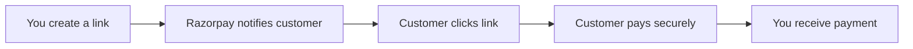

Payment Links let you collect payments from customers without building a checkout page or integrating a payment gateway. You generate a unique link, share it through any channel, and Razorpay handles the secure payment experience for your customer.

## Key advantages

<CardGroup cols={2}>
  <Card title="Create in minutes" icon="clock">
    Generate a payment link from the Dashboard or via API in seconds and share it immediately.
  </Card>
  <Card title="Automatic notifications" icon="bell">
    Razorpay sends SMS and email notifications to your customer as soon as you create the link.
  </Card>
  <Card title="Partial payments" icon="chart-pie">
    Allow customers to pay in installments by enabling partial payments and setting a minimum first amount.
  </Card>
  <Card title="Expiry and reminders" icon="calendar">
    Set an expiry date on any link and configure automated SMS reminders to reduce drop-off.
  </Card>
</CardGroup>

## How Payment Links work



## Payment link states

Every Payment Link moves through the following states:

<AccordionGroup>
  <Accordion title="created">
    The link has been generated but no payment has been made yet. You can still edit or cancel the link.
  </Accordion>
  <Accordion title="partially_paid">
    A partial payment has been received. This state only applies when `accept_partial` is enabled.
  </Accordion>
  <Accordion title="paid">
    The full amount has been collected. The link is no longer payable.
  </Accordion>
  <Accordion title="cancelled">
    You manually cancelled the link from the Dashboard or via API. Cancelled links cannot be reopened.
  </Accordion>
  <Accordion title="expired">
    The link passed its `expire_by` date without being fully paid. Expired links cannot be reopened.
  </Accordion>
</AccordionGroup>

## Create a Payment Link via API

Use the `POST /v1/payment_links` endpoint to create a link programmatically. You can integrate this directly into your order management workflow.

<CodeGroup>

```bash cURL
curl -X POST https://api.razorpay.com/v1/payment_links \
  -u rzp_test_YOUR_KEY_ID:YOUR_KEY_SECRET \
  -H "Content-Type: application/json" \
  -d '{
    "amount": 1000,
    "currency": "USD",
    "accept_partial": false,
    "description": "Payment for Order #12345",
    "customer": {
      "name": "Jane Doe",
      "email": "jane.doe@example.com",
      "contact": "+19000000000"
    },
    "notify": {
      "sms": true,
      "email": true
    },
    "reminder_enable": true,
    "expire_by": 1893456000
  }'
```

</CodeGroup>

<Note>
  The `amount` field is in the smallest currency unit. For USD, `1000` equals $10.00.
</Note>

**Successful response:**

```json
{
  "id": "plink_ERgihyaAAC0VNW",
  "entity": "payment_link",
  "accept_partial": false,
  "amount": 1000,
  "amount_paid": 0,
  "cancelled_at": 0,
  "created_at": 1591097057,
  "currency": "USD",
  "customer": {
    "contact": "+19000000000",
    "email": "jane.doe@example.com",
    "name": "Jane Doe"
  },
  "description": "Payment for Order #12345",
  "expire_by": 1893456000,
  "expired_at": 0,
  "reference_id": null,
  "reminder_enable": true,
  "short_url": "https://rzp.io/i/nxrHnLJ",
  "status": "created",
  "updated_at": 1591097057,
  "user_id": ""
}
```

The `short_url` in the response is what you share with your customer. Razorpay also automatically sends an SMS and/or email if you set `notify.sms` or `notify.email` to `true`.

## Create a Payment Link from the Dashboard

<Steps>
  <Step title="Open Payment Links">
    Go to your [Razorpay Dashboard](https://dashboard.razorpay.com) and navigate to **Payment Links** in the left sidebar.
  </Step>
  <Step title="Create a new link">
    Click **Create Payment Link** in the top-right corner.
  </Step>
  <Step title="Enter payment details">
    Fill in the amount, currency, and a description that helps your customer identify the payment.
  </Step>
  <Step title="Add customer information">
    Enter the customer's name, email address, and phone number. Razorpay uses these for automatic notifications.
  </Step>
  <Step title="Configure options">
    Set an expiry date, enable partial payments, or turn on automated SMS reminders as needed.
  </Step>
  <Step title="Send the link">
    Click **Send** to generate the link and deliver it to your customer via the notification channels you selected.
  </Step>
</Steps>

## Managing links from the Dashboard

From the **Payment Links** section in your Dashboard you can:

- **Search** for a link by ID, customer name, or reference
- **Duplicate** an existing link to reuse the same settings
- **Cancel** a link that is no longer needed
- **Update** the expiry date or reminder settings on a `created` link

<Tip>
  Use the `reference_id` field in the API request to attach your internal order ID to a Payment Link. This makes it easier to reconcile payments in your system.
</Tip>

<Warning>
  Once a link reaches `paid`, `cancelled`, or `expired` status, it cannot be modified or reactivated. Create a new link if you need to collect payment again.
</Warning>
