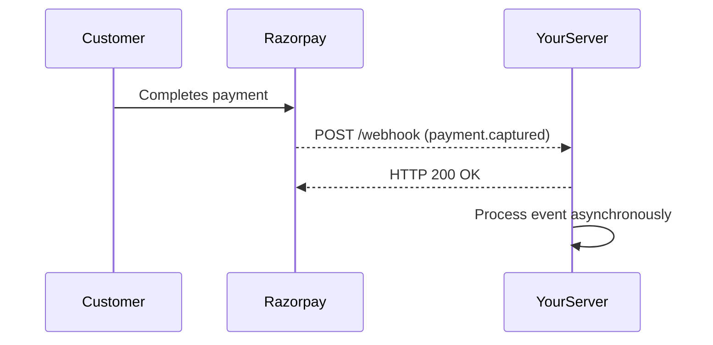

Webhooks — also called Web Callbacks, HTTP Push APIs, or Reverse APIs — let Razorpay notify your application automatically when specific events occur, such as a payment being captured or a refund being processed. Instead of repeatedly polling the Razorpay API to check for updates, your server receives an HTTP POST request with a JSON payload the moment an event is triggered.

## How webhooks work

When an event occurs in Razorpay (for example, a customer completes a payment), Razorpay sends a signed HTTP POST request to the endpoint URL you configured in your Dashboard. Your server processes the payload and responds with HTTP 200 to acknowledge receipt.

## Webhooks vs. API polling

Both approaches can tell you whether a payment succeeded, but they suit different situations.

| | Webhooks | API polling |
|---|---|---|
| **Timing** | Near real-time, pushed automatically | On demand, when you request |
| **Server load** | Low — only triggered on events | Higher — continuous requests |
| **Best for** | Automation, background processing | Instant user-facing confirmation |
| **Reliability** | Retried automatically on failure | Depends on your retry logic |

<Tip>
  Rely on webhooks for all automation and background tasks. If a webhook has not arrived within your acceptable time window for a user-facing flow (such as showing a "Payment Successful" screen), fall back to a direct API call to fetch the payment status.
</Tip>

## Key use cases

<AccordionGroup>
  <Accordion title="Capturing late-authorized payments" icon="clock">
    A payment can initially appear as **Failed** on the Dashboard but later transition to **Authorized** — for example, when a bank's response is delayed. Subscribe to the `payment.authorized` event to detect these cases and capture the payment before the authorization window closes.
  </Accordion>

  <Accordion title="Notifying customers on payment failure" icon="circle-exclamation">
    When a payment fails, you want to let your customer know immediately and offer them a way to retry. Subscribe to the `payment.failed` event to trigger a notification email or SMS and surface a retry option in your UI.
  </Accordion>

  <Accordion title="Order fulfillment and inventory updates" icon="box">
    Trigger downstream workflows — warehouse picks, inventory decrements, shipping label generation — only after you receive the `order.paid` event. This ensures you never fulfill an unpaid order.
  </Accordion>

  <Accordion title="Refund tracking" icon="rotate-left">
    Razorpay initiates refunds asynchronously. Use the `refund.processed` event to update your records, send a confirmation to the customer, and reconcile your accounts — rather than polling until the refund status changes.
  </Accordion>
</AccordionGroup>

## Implementation checklist

Before going live with webhooks, make sure your endpoint:

- Responds with **HTTP 200 within 5 seconds** of receiving the request
- Verifies the **HMAC-SHA256 signature** on every incoming payload using your webhook secret
- Handles **duplicate deliveries** gracefully — Razorpay retries failed deliveries, so your handler must be idempotent
- Logs the **raw request body** before parsing, to aid debugging if a payload is malformed

<Note>
  Razorpay retries failed webhook deliveries up to 8 times over 24 hours. Design your endpoint to return 200 as quickly as possible, then process the event asynchronously (for example, push it to a queue).
</Note>
